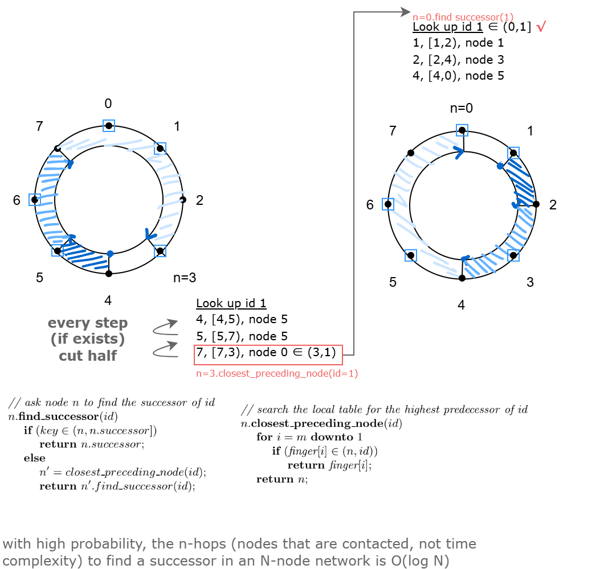
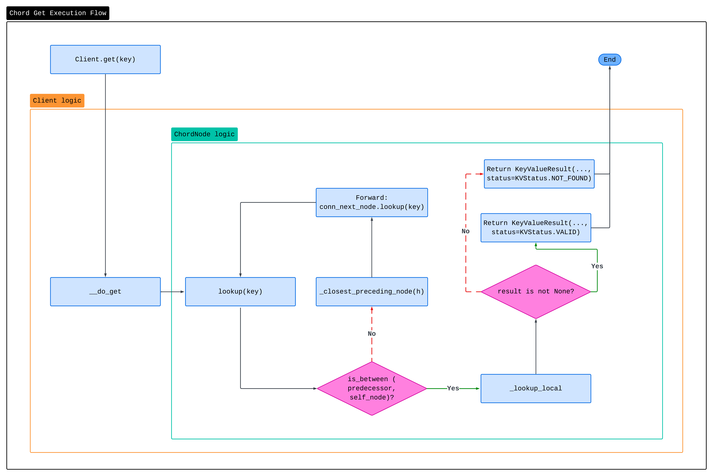
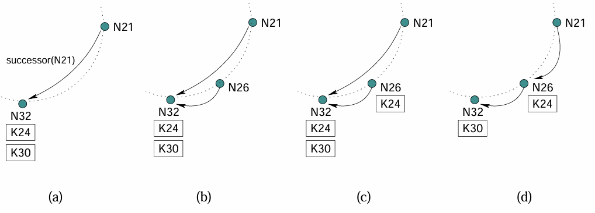

# chord

Select: 项目

### Overview of Chord Model

Chord is a distributed hash table (DHT) protocol that provides efficient key lookups in a distributed system. It organizes nodes in a circular identifier space, where each node and key is assigned an identifier using consistent hashing. 

#### Consistent Hashing

> a data partition method in distributed system
> 
- hash value range: $[0, 2^{32}-1]$
- basic idea: map nodes (servers) and data (formatted as $<key, value>$ pairs) to hash value space:
    - nodes are located in `hash(IP)`
    - data are stored in the node with the smallest hash value that bigger than `hash(key)`

**problems:**

- uneven nodes distribution
- avalanche (snow slide)

**solution:**
introducing virtual nodes, e.g., for real node a, add virtual nodes with values: `hash(a-0)`, `has(a-1)`, `hash(a-2)`

The main operations in Chord include:

- **Join**: Adding a new node to the Chord ring.
- **Stabilize**: Ensuring the ring structure remains consistent.
- **Lookup**: Finding the node responsible for a given key.
- **Finger Table**: Optimizing lookups by maintaining pointers to nodes at specific intervals.

#### Advantages of Chord Model

1. **Consistent Hashing**: Ensures that keys are evenly distributed among nodes. When a node joins or leaves, only a fraction of keys need to be moved.
2. **Scalability**: Lookups require `O(log N)` messages, where `N` is the number of nodes.
3. **Fault Tolerance**: Nodes periodically stabilize to recover from failures and maintain the ring structure.

### Algorithms

#### Basic Query

```cpp
// ask node n to find the successor of id
n.find_successor(id)
    if (id ∈ (n, n.successor])
        return n.successor;
    else
        // forward the query around the circle
        return successor.find_successor(id);
```

#### Finger Table

```cpp
n.find_successor(id)
    if (key ∈ (n, n.successor])
        return n.successor;
    else
        n2 = closest_preceding_node(id)
        return n2.find_successor(id);

// search the local table for the highest predecessor of id
n.closest_preceding_node(id)
    for i = m downto 1
        if (finger[i] ∈ (n, id))
            return finger[i];
    return n;
```

### Example

request get(1) from node 3



## Implementation



### Functions

#### `find_successor`

1. Check if the key lies between the current node and its successor.
2. If yes, return the successor.
3. Otherwise, find the closest preceding node using the finger table.
4. Forward the `find_successor` request to the closest preceding node.

#### `closest_preceding_node`

1. Iterate through the finger table from the highest entry to the lowest.
2. Find the highest node in the finger table that lies between the current node and the target key.
3. Return this node.

#### `join`

1. Connect to an existing node in the Chord ring and `find_successor` .
2. Build the finger table.
3. Set the successor of the new node.

#### `stabilize`

1. Check the predecessor of the current node’s successor.
2. If the predecessor is a better fit successor, update.
3. Notify the successor to update its predecessor.



### Testing

```bash
# Start servers
python server.py -p 50001
python server.py -p 50002
python server.py -p 50003

# Run simulation
python simulation.py

# Finger table mode
python server.py -p 50001 --task_type finger_table
python server.py -p 50002 --task_type finger_table
python server.py -p 50003 --task_type finger_table
python simulation.py --task_type finger_table

# Test operations
get no-key
get test-key-0
get test-key-29
get test-key-28
put key-1 value-1
get key-1
```