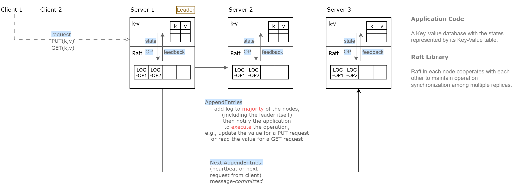
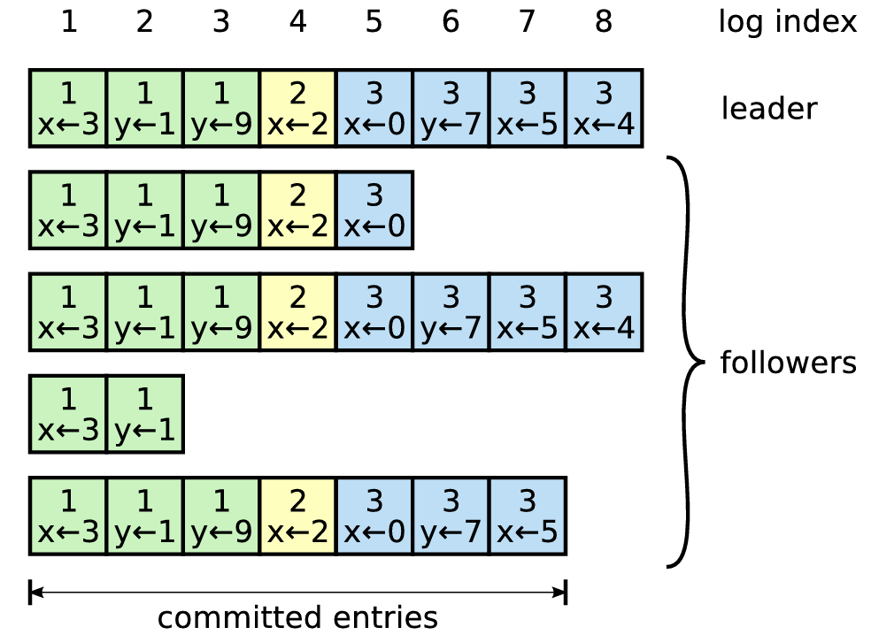
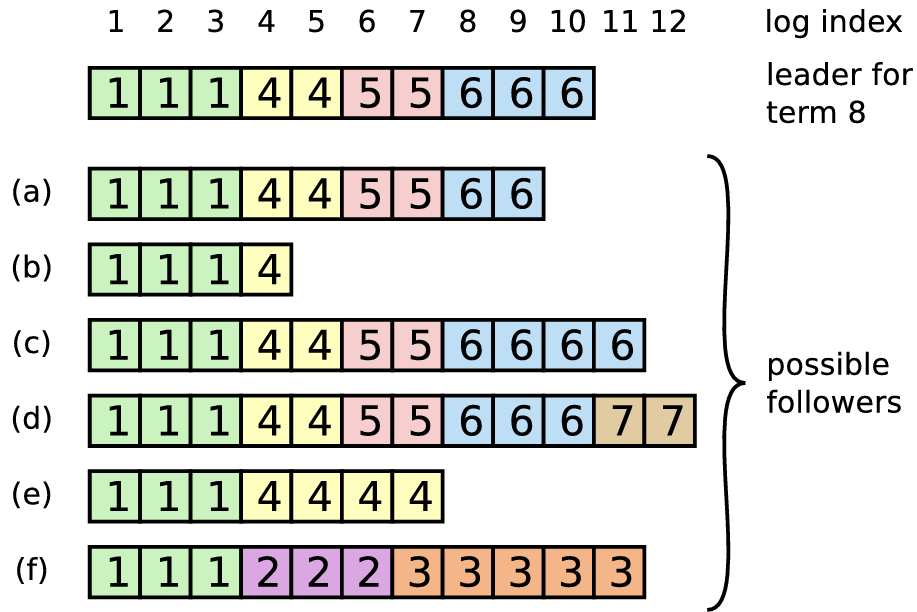

# 基于 Raft 的k-v存储数据库

Select: 项目

# 项目背景与介绍

## 背景

大规模分布式系统，传统的集中式数据库在面对大规模数据和高并发访问时可能面临**单点故障**和**性能瓶颈**的问题。

## 解决的问题

- **一致性**：通过Raft算法确保数据的强一致性，使得系统在正常和异常情况下都能够提供一致的数据视图。
- **可用性**：通过分布式节点的复制和自动故障转移，实现高可用性，即使在部分节点故障的情况下，系统依然能够提供服务。
- **分区容错**：处理网络分区的情况，确保系统在分区恢复后能够自动合并数据一致性。

## 技术栈

- **Raft 一致性算法**：确保数据的一致性和容错性
- **存储引擎**：键值对 k-v 数据库，目前选择跳表

> 关注 Raft 算法本身；思考：简单的代码如何保证在复杂情况下的容错
> 

## 参考资料

1. [卡哥的跳表](https://github.com/youngyangyang04/Skiplist-CPP)
2. [mit6.824课程的汉化book](https://mit-public-courses-cn-translatio.gitbook.io/mit6-824/)
3. [raft算法的可视化](https://raft.github.io/)
4. [分布式系统之CAP理论](https://cloud.tencent.com/developer/article/1860632)
5. [分布式简单入门知识集合](https://erdengk.top/archives/fen-bu-shi-jian-dan-ru-men-zhi-shi)
6. [Raft的介绍](https://eli.thegreenplace.net/2020/implementing-raft-part-1-elections/)
7. [大佬的知乎](https://www.zhihu.com/people/tan-xin-yu-22)
8. [mit6.824的讲义](http://nil.csail.mit.edu/6.824/2020/notes/l-raft.txt)
9. raft论文

## 项目模块

> 难点
> 
- Raft 算法的理解与实现
    - **raft 节点**：Raft 算法核心，负责与其他机器的 raft 节点沟通，达到 分布式共识 的目的
    - **raftServer**：负责 raft 节点与 k-v 数据库中间的协调服务；负责持久化 k-v 数据库的数据（可选）
    - **持久层**：负责相关数据的落盘，对 raft 节点， 根据共识算法要求，必须对一些关键数据进行落盘处理，以保证节点宕机后重启程序可以恢复关键数据；对于 raftServer，可能会有一些 k-v 数据库的东西需要落盘持久化
- **RPC 通信框架**的理解与实现
    - 在 领导者选举、日志复制、数据查询、心跳等多个Raft重要过程中提供多节点快速简单的通信能力
- **k-v 数据库**
    - 即上层状态机，负责数据存储

## 简历与项目问题

[简历写法](https://www.notion.so/3358601f62968058a96dce03a5823c9a?pvs=21)

[项目问题](https://www.notion.so/3358601f629680aeb53fdfb2f484bac3?pvs=21)

# Raft

[raft-extended.pdf](./images/raft-extended.pdf)

[pdos.csail.mit.edu](https://pdos.csail.mit.edu/6.824/notes/l-raft.txt)

## Raft 框架



### Server Communication

through remote procedure calls (RPCs):

- **RequestVote** RPCs: initiated by candidates during elections
- **AppendEntries** RPCs: initiated by leaders to
    - replicate log entries
    - provide heartbeat (no log entries): leaders send periodic heartbeats to all followers to maintain their authority → if a follower receives no communication over a period of time *timeout*, then begins an **election**

### Term

raft time is divided into terms with arbitrary length. a term includes:

- **leader election**: one or more candidate attempt to become leader
    - case when a split vote: term ends with no leader, followed by a new election
    - case when a successful vote (a candidate receives a majority of votes): leader manages the cluster (execute operations)

## Log Replication / Recovery

### AppendEntries struct

```cpp
struct AppendEntries {
	int term;         // leader's term
	int leaderID;     // leader's ID (redirect client's request from follower to leader)
	int prevLogIndex;
	int preLogTerm;
	int entries[];    // the log entry to be stored (empty if a heartbeat AppendEntry; multiple entry a time for efficiency)
	int leaderCommit; // the max log entry index known to the leader
}
```

### Scenarios

- every entry contains
    - the term in which it was created
    - a command for a state machine
- an entry is considered *committed* if it is safe for that entry to be applied to state machines



> consistent scenarios
> 



> inconsistent scenarios
> 

a follower

- may be missing entries <a-b>
- may have extra uncommitted entries <c-d>
- or both <e-f>

**scenarios <f>** could occur if that server was the leader for term 2, added several entries to its log, then crashed before committing any of them; it restarted quickly, became leader for term 3, and added a few more entries to its log; before any of the entries in either term 2 or term 3 were committed, the server crashed again and remained down for several terms

[图解 Raft 共识算法：如何复制日志？-腾讯云开发者社区-腾讯云](https://cloud.tencent.com/developer/article/1833188)

### Recovery

> through consistency check performed by AppendEntries RPCs
> 

in handling inconsistencies, the leader forces the followers’ logs to be **overwritten** by its own. the leader:

1. find the latest log entry that is consistent with the follower (decrements nextIndex and retries the AppendEntries  RPCs repeatedly)
2. delete any entries in the follower’s log after the point
3. send the follower all its entries after that point